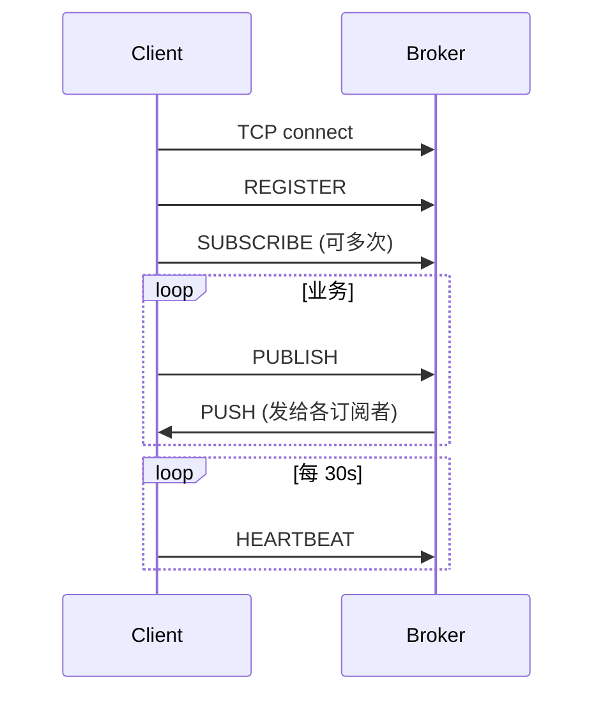

# 消息中间件通信协议说明

> **版本**：v1.0  
> **状态**：已冻结，Server / Client 实现均以此为准  
> **默认端口**：`9090`  
> **字符编码**：UTF-8  

---

## 1. 传输层

| 项 | 约定 |
|----|------|
| 协议 | TCP 长连接 |
| 地址 | `127.0.0.1`（可配置 `broker.host`） |
| 端口 | `9090`（可配置 `broker.port`） |
| 连接生命周期 | 建立后保持，直到主动关闭、心跳超时或 IO 异常 |

---

## 2. 帧格式（粘包方案）

采用 **「一行一个 JSON」**：每帧为一条 UTF-8 JSON 字符串，以 **换行符 `\n`（0x0A）** 结尾。

```
<json-body>\n
```

**读写规则**：

1. 发送方：序列化 JSON → 写入字节 → 写入 `\n` → `flush()`  
2. 接收方：按字节读取直到遇到 `\n`，将该行（不含 `\n`）作为一帧解析  
3. 空行忽略；解析失败记录日志并关闭连接（本版本不定义 ERROR 回包帧）

**不采用** 4 字节长度前缀（留作后续扩展）。

---

## 3. 协议帧通用结构

每一帧是一个 JSON 对象，**必填字段**：

| 字段 | 类型 | 说明 |
|------|------|------|
| `type` | string | 命令类型，见第 4 节，**大写**枚举名 |

**可选字段**（按命令类型使用）：

| 字段 | 类型 | 说明 |
|------|------|------|
| `clientId` | string | 客户端标识，REGISTER 必填 |
| `topic` | string | 主题名，SUBSCRIBE / UNSUBSCRIBE 必填 |
| `message` | object | 业务消息体，PUBLISH / PUSH 必填 |

---

## 4. 命令类型

| type | 方向 | 说明 | 本版本 |
|------|------|------|--------|
| `REGISTER` | C → S | 注册客户端 ID | **必做** |
| `SUBSCRIBE` | C → S | 订阅主题 | **必做** |
| `UNSUBSCRIBE` | C → S | 取消订阅 | 可选 |
| `PUBLISH` | C → S | 发布消息，Broker 入队后异步分发 | **必做** |
| `PUSH` | S → C | Broker 向订阅者推送消息 | **必做** |
| `HEARTBEAT` | C ↔ S | 保活 | **必做** |
| `ACK` | C ↔ S | 确认收到 PUSH | **不做**（v1 省略） |

> **C** = Client（Publisher / Subscriber SDK）  
> **S** = Server（Broker）

---

## 5. 业务消息 `message` 对象

Publisher 与 Subscriber 之间传递的数据单元，字段固定：

| 字段 | 类型 | 必填 | 说明 |
|------|------|------|------|
| `topic` | string | 是 | 主题，如 `network.alert` |
| `payload` | string | 是 | 业务内容：纯文本或 **字符串形式的 JSON**（不再嵌套一层对象） |
| `timestamp` | number | 是 | 发送时刻，Unix 毫秒，`System.currentTimeMillis()` |

**示例 payload（告警）**：

```json
"{\"event\":\"LINK_DOWN\",\"host\":\"switch-3\"}"
```

即：`message.payload` 的值是一个 JSON 字符串（转义后放在帧里）。

---

## 6. 各命令 JSON 样例

### 6.1 REGISTER（C → S）

连接成功后 **应首先发送**（同一连接只需一次）。

```json
{"type":"REGISTER","clientId":"probe-1"}
```

| 字段 | 要求 |
|------|------|
| `clientId` | 非空，长度 1～64，建议 `[a-zA-Z0-9_-]+` |

---

### 6.2 SUBSCRIBE（C → S）

```json
{"type":"SUBSCRIBE","topic":"network.alert"}
```

| 字段 | 要求 |
|------|------|
| `topic` | 非空，长度 1～128，建议小写 + 点分：`[a-z0-9]+(\\.[a-z0-9]+)*` |

---

### 6.3 UNSUBSCRIBE（C → S，可选）

```json
{"type":"UNSUBSCRIBE","topic":"network.alert"}
```

---

### 6.4 PUBLISH（C → S）

```json
{"type":"PUBLISH","message":{"topic":"network.alert","payload":"{\"event\":\"HIGH_LATENCY\",\"ms\":500}","timestamp":1717234567890}}
```

| 规则 | 说明 |
|------|------|
| `message.topic` | 必须与路由主题一致；订阅者按此 topic 匹配 |
| `message.timestamp` | 客户端生成；用于延迟统计 |

---

### 6.5 PUSH（S → C）

服务端向该 topic 的所有订阅者各发一帧（内容相同，每连接独立写）：

```json
{"type":"PUSH","message":{"topic":"network.alert","payload":"{\"event\":\"HIGH_LATENCY\",\"ms\":500}","timestamp":1717234567890}}
```

客户端读线程收到 `type=PUSH` 后，调用 `MessageListener.onEvent(message)`。

---

### 6.6 HEARTBEAT（C → S 或 S → C）

```json
{"type":"HEARTBEAT"}
```

| 项 | 约定 |
|----|------|
| 客户端周期 | 每 **30 秒** 发送一次 |
| 服务端超时 | **90 秒** 未收到任何帧（含 HEARTBEAT）则关闭连接并清理订阅 |
| 服务端主动发 | 可选；v1 仅要求客户端发即可 |

---

## 7. 连接与命令顺序



**服务端校验（v1）**：

| 时机 | 行为 |
|------|------|
| 未 REGISTER 就 SUBSCRIBE / PUBLISH | 忽略或关闭连接（实现时二选一，建议 **关闭并打日志**） |
| 重复 REGISTER | 忽略第二次或覆盖（建议 **忽略**） |
| PUBLISH 无订阅者 | 正常入队、分发 0 次，不报错 |
| JSON 缺字段 / type 未知 | 关闭连接 |

---

## 8. Demo 主题命名（网络服务管理系统）

| topic | 发布者 | 订阅者 | 说明 |
|-------|--------|--------|------|
| `network.alert` | 探针 Agent | 监控台、工单服务 | 链路告警 |
| `ticket.created` | 工单服务 | 通知中心 | 工单已创建 |

**clientId 建议**：

| clientId | 角色 |
|----------|------|
| `probe-1` | 探针 |
| `monitor-1` | 监控台 |
| `ticket-1` | 工单服务 |
| `notify-1` | 通知中心 |

---

## 9. 完整联调示例（按时间顺序）

**1. 订阅者连接并订阅**

```text
→ {"type":"REGISTER","clientId":"monitor-1"}
→ {"type":"SUBSCRIBE","topic":"network.alert"}
→ {"type":"HEARTBEAT"}
```

**2. 发布者连接并发布**

```text
→ {"type":"REGISTER","clientId":"probe-1"}
→ {"type":"PUBLISH","message":{"topic":"network.alert","payload":"{\"event\":\"LINK_DOWN\"}","timestamp":1717234567890}}
```

**3. 订阅者收到推送**

```text
← {"type":"PUSH","message":{"topic":"network.alert","payload":"{\"event\":\"LINK_DOWN\"}","timestamp":1717234567890}}
```

（`←` 表示服务端 → 客户端）

---

## 10. 实现备注

| 项 | 建议 |
|----|------|
| JSON 库 | Jackson（`pom.xml` 增加 `jackson-databind`）或手写解析 |
| 代码对应 | `broker.protocol.Command`、`Message`、`ProtocolCodec` |
| 写 Socket | 每个 `ClientSession` 对 `OutputStream` **加锁**，保证帧不交叉 |
| 性能测试 | 在 `payload` 内增加 `sendTime` 字段（仍放在 payload 字符串 JSON 里） |

---

## 11. 变更记录

| 版本 | 日期 | 说明 |
|------|------|------|
| v1.0 | 2026-06-01 | 初版：`\n` 分帧、6 种命令、ACK 不做、端口 9090 |
